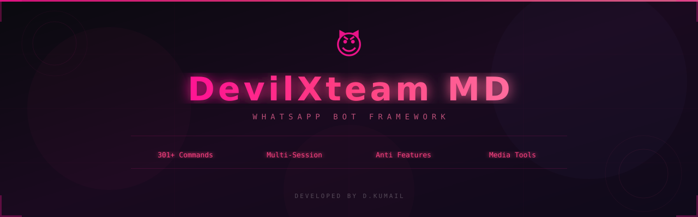
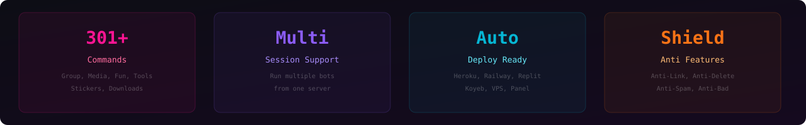

<div align="center">



<br/><br/>

[](https://github.com/Devilkumail-MD/DevilXTeam-MD)
[](https://github.com/Devilkumail-MD/DevilXTeam-MD)
[](https://nodejs.org)
[](LICENSE)
[](https://github.com/Devilkumail-MD/DevilXTeam-MD/stargazers)

<br/>

```
╔══════════════════════════════════════════════════════╗
║  😈  D E V I L X T E A M   M D                      ║
║  ⚡  Premium WhatsApp Bot Framework                  ║
║  🔥  301+ Commands • Multi-Session • Auto Deploy     ║
╚══════════════════════════════════════════════════════╝
```

</div>

---

<div align="center">

## ⚡ Features



</div>

<br/>

<table align="center">
<tr>
<td align="center" width="25%">

### 🎭 Group Tools
```
┃ Kick / Ban
┃ Promote / Demote
┃ Mute / Unmute
┃ Anti-Link
┃ Warnings
┃ Welcome/Goodbye
```

</td>
<td align="center" width="25%">

### 🎵 Media Tools
```
┃ Video Download
┃ Audio Download
┃ Sticker Maker
┃ Image Editor
┃ TTS / Voice
┃ PDF Generator
```

</td>
<td align="center" width="25%">

### 🤖 AI & Chat
```
┃ AI Chatbot
┃ Image Generation
┃ Voice Chat
┃ Translation
┃ Smart Replies
┃ Auto Responses
```

</td>
<td align="center" width="25%">

### 🛡️ Protection
```
┃ Anti-Delete
┃ Anti-Spam
┃ Anti-Link
┃ Anti-Bad Words
┃ Anti-Sticker
┃ Auto-Kick
```

</td>
</tr>
</table>

---

<div align="center">

## 🔗 Get Session ID

<br/>

<a href="https://devilxteam.replit.app">

</a>

<br/><br/>

```
┌─────────────────────────────────────────┐
│  1. Visit DevilXteam session site       │
│  2. Enter WhatsApp number              │
│  3. Copy pairing code                  │
│  4. Open WhatsApp > Linked Devices     │
│  5. Link with phone number             │
│  6. Enter pairing code                 │
│  7. Get your SESSION ID on WhatsApp    │
└─────────────────────────────────────────┘
```

</div>

---

<div align="center">

## 🚀 One-Click Deploy

<br/>

<a href="https://heroku.com/deploy?template=https://github.com/Devilkumail-MD/DevilXTeam-MD">

</a>
&nbsp;&nbsp;
<a href="https://railway.app/new/template?template=https://github.com/Devilkumail-MD/DevilXTeam-MD">

</a>
&nbsp;&nbsp;
<a href="https://replit.com/github/Devilkumail-MD/DevilXTeam-MD">

</a>
&nbsp;&nbsp;
<a href="https://app.koyeb.com/deploy?type=git&repository=github.com/Devilkumail-MD/DevilXTeam-MD">

</a>

</div>

---

<div align="center">

## 💻 Manual Setup

</div>

<br/>

### Docker
```bash
docker build -t devilxteam-md .
docker run -e SESSION=DKML~xxxx -e SESSION_URL=https://your-site.replit.app devilxteam-md
```

### VPS / Local
```bash
git clone https://github.com/Devilkumail-MD/DevilXTeam-MD.git
cd DevilXteam-MD
yarn install
```

Create `config.env`:
```env
SESSION=DKML~your_session_id
SESSION_URL=https://devilxteam.replit.app
SUDO=923001234567
MODE=private
```

Start:
```bash
npm start
# or
node index.js
```

---

<div align="center">

## ⚙️ Environment Variables

</div>

<br/>

```
╔══════════════════╦══════════════════╦══════════════════════════════════╗
║   Variable       ║   Default        ║   Description                    ║
╠══════════════════╬══════════════════╬══════════════════════════════════╣
║ SESSION          ║ -                ║ Session ID (DKML~xxx)            ║
║ SESSION_URL      ║ -                ║ Session site URL                 ║
║ SUDO             ║ -                ║ Owner number(s)                  ║
║ MODE             ║ private          ║ private / public                 ║
║ BOT_NAME         ║ DevilXteam MD    ║ Bot display name                 ║
║ HANDLERS         ║ .,               ║ Command prefix(es)               ║
║ CHATBOT          ║ off              ║ AI chatbot toggle                ║
║ LANGUAGE         ║ english          ║ Bot language                     ║
║ WARN             ║ 4                ║ Warn limit before kick           ║
║ ANTI_DELETE      ║ false            ║ Anti-delete messages             ║
║ AUTO_UPDATE      ║ true             ║ Auto-update bot                  ║
║ DATABASE_URL     ║ ./bot.db         ║ Database path/URL                ║
║ PORT             ║ 3000             ║ Health server port               ║
╚══════════════════╩══════════════════╩══════════════════════════════════╝
```

---

<div align="center">

## 📁 Project Structure

</div>

```
DevilXteam-MD/
├── 📄 index.js            # Entry point
├── 📄 config.js           # Configuration
├── 📁 core/
│   ├── auth.js            # Authentication
│   ├── bot.js             # Bot engine
│   ├── handler.js         # Message handler
│   ├── manager.js         # Session manager
│   ├── database.js        # Database layer
│   ├── store.js           # Message store
│   ├── helpers.js         # Utilities
│   ├── schedulers.js      # Cron jobs
│   └── constructors/      # Message constructors
├── 📁 plugins/
│   ├── commands.js        # Menu & commands
│   ├── group.js           # Group management
│   ├── converters.js      # File converters
│   ├── manage.js          # Bot management
│   ├── media.js           # Media tools
│   ├── chatbot.js         # AI chatbot
│   ├── downloaders.js     # Video/Audio DL
│   ├── youtube.js         # YouTube tools
│   ├── fun.js             # Fun commands
│   ├── tools.js           # Utility tools
│   └── ...                # 20+ more plugins
├── 📁 assets/
│   ├── banner.png         # Repo banner
│   ├── features.png       # Features card
│   └── team.png           # Team banner
├── 📄 Dockerfile          # Docker config
├── 📄 Procfile            # Heroku config
├── 📄 app.json            # Heroku manifest
├── 📄 railway.json        # Railway config
└── 📄 package.json        # Dependencies
```

---

<div align="center">

## 👥 Team


<br/><br/>

| 👑 D.Kumail | 😈 Black Devil | 🦁 Zahid King | ✍️ Waqar | 🎭 Marco |
|:-:|:-:|:-:|:-:|:-:|
| Lead Dev | Co-Dev | Team | Team | Team |
| [WhatsApp](https://wa.me/923554080521) | [WhatsApp](https://wa.me/923049730127) | [WhatsApp](https://wa.me/923044154575) | [WhatsApp](https://wa.me/923375626980) | [WhatsApp](https://wa.me/923706328012) |

</div>

---

<div align="center">

## 📜 License

MIT License — DevilXteam MD

<br/>

```
╔══════════════════════════════════════╗
║     😈 DevilXteam MD v1.0.0         ║
║     Powered by D.Kumail             ║
║     github.com/DevilXteam           ║
╚══════════════════════════════════════╝
```

<br/>


</div>
